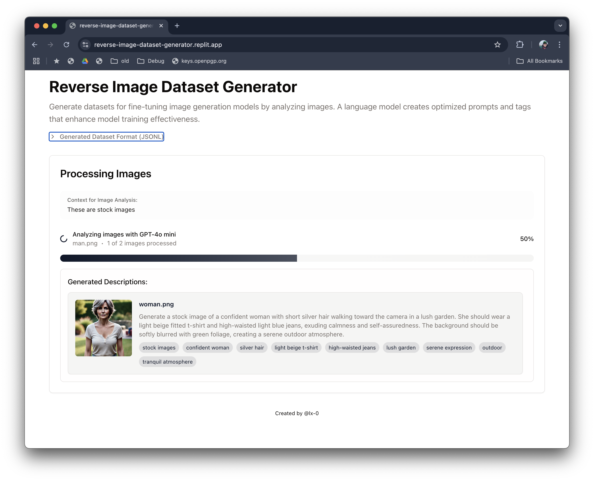

# Reverse Image Dataset Generator 🖼️ → 📝

> Create high-quality training datasets for image generation models by automatically generating optimized prompts from your images using advanced GPT models.

<div align="center">

[](https://www.typescriptlang.org/)
[](https://reactjs.org/)
[](https://expressjs.com/)
[](https://openai.com/)
[](https://www.postgresql.org/)



</div>

## ✨ Features

- 🤖 **AI-Powered Analysis**: Automatically generate optimized prompts using GPT models
- 🎯 **Context-Aware**: Include custom context to guide prompt generation
- 📦 **Batch Processing**: Handle multiple images simultaneously
- 🏷️ **Smart Tagging**: Auto-generate relevant tags for better organization
- 📤 **Standard Format**: Export datasets in JSONL format ready for fine-tuning
- 👀 **Live Preview**: Real-time visualization of generated prompts and tags
- 🔄 **Progress Tracking**: Monitor batch processing with detailed progress updates

## 🚀 Quick Start

### Prerequisites

- Node.js (v18 or later)
- NPM (v8 or later)
- OpenAI API key
- PostgreSQL database ([setup guide](docs/database.md))

### Installation

1. Clone and install dependencies:

```bash
git clone https://github.com/yourusername/reverse-image-dataset-generator.git
cd reverse-image-dataset-generator
npm install
```

2. Set up your environment:

```bash
cp .env.example .env
```

3. Add your OpenAI API key to `.env`:

```env
OPENAI_API_KEY=your_api_key_here
```

4. Start the development server:

```bash
npm run dev
```

Visit `http://localhost:5050` to start using the application.

## 💡 Use Cases

### Fine-Tuning Image Generation Models

- Create custom training datasets for models like OmniGen
- Generate high-quality prompts from existing image collections
- Maintain consistency in prompt style across datasets

### Dataset Management

- Convert image libraries into structured training data
- Add context-aware descriptions to image collections
- Generate semantic tags for better organization

### Content Creation

- Generate optimized prompts for existing images
- Create consistent image-prompt pairs
- Build reference libraries for prompt engineering

## 📖 How It Works

1. **Upload Images**
   - Drag & drop or select multiple images
   - Add optional context for better descriptions
   - Preview selected images instantly

2. **AI Processing**
   - Images analyzed by GPT models
   - Context-aware prompt generation
   - Automatic tag extraction
   - Real-time progress tracking

3. **Dataset Creation**
   - JSONL file generation with prompts
   - Original images included
   - ZIP archive for easy download
   - Standard format for fine-tuning

Example output format:

```jsonl
{
  "task_type": "text_to_image",
  "instruction": "a serene landscape with snow-capped mountains reflecting in a crystal-clear lake at sunset",
  "input_images": [],
  "output_image": "mountain_lake.jpg"
}
```

## 🛠️ Technical Details

### Architecture

- **Frontend**: React + TypeScript + Shadcn UI
- **Backend**: Express.js + Multer
- **Database**: PostgreSQL ([configuration guide](docs/database.md))
- **AI**: OpenAI GPT-4o series models
- **Storage**: File system with organized structure

### Available Models

- `gpt-4o-mini`: Fast, efficient processing
- `gpt-4o`: Balanced performance
- `gpt-4o-2024-11-20`: Latest model with enhanced capabilities

## 🤝 Contributing

1. Fork the repository
2. Create your feature branch (`git checkout -b feature/amazing-feature`)
3. Commit your changes (`git commit -m 'Add amazing feature'`)
4. Push to the branch (`git push origin feature/amazing-feature`)
5. Open a Pull Request

## 📝 License

This project is licensed under the MIT License - see the [LICENSE](LICENSE) file for details.

## 🌟 Next Steps

- [ ] Add user authentication
- [ ] Implement dataset management UI
- [ ] Add advanced image processing options
- [ ] Optimize batch processing
- [ ] Add dataset search and filtering

## 🔗 Links

- [Documentation](docs/README.md)
- [Database Guide](docs/database.md)
- [API Reference](docs/api.md)
- [Contributing Guidelines](CONTRIBUTING.md)

# Docker Setup

## Port Configuration

The application uses the following default ports:
- `5050`: Main application server
- `5173`: Vite development server (development only)
- `5432`: PostgreSQL database

To avoid port conflicts, you can customize these ports in your environment files:

```env
PORT=5050            # Main application port
VITE_PORT=5173      # Vite dev server (development only)
DB_PORT=5432        # PostgreSQL port
```

## Development Environment

1. Copy environment files:

   ```bash
   cp .env.development.example .env.development
   ```

2. Adjust ports if needed in `.env.development`

3. Start development environment:

   ```bash
   docker compose -f docker-compose.dev.yml --env-file .env.development up --build
   ```

The development environment includes:
- Hot reloading for both frontend and backend
- PostgreSQL database with automatic schema initialization
- Vite dev server for frontend development

## Production Environment

1. Copy environment files:

   ```bash
   cp .env.production.example .env.production
   ```

2. Update production environment variables:
   - Set secure PostgreSQL password
   - Configure OpenAI API key
   - Adjust ports if needed
   - Adjust other settings as needed

3. Start production environment:

   ```bash
   docker compose -f docker-compose.prod.yml --env-file .env.production up -d --build
   ```

The production environment includes:
- Optimized production build
- PostgreSQL database with persistent storage
- Automatic container restart
- Health checks for all services

## Database Management

The database is automatically initialized with the schema and migrations when the container starts. To manage the database:

1. Generate new migrations:

   ```bash
   docker compose -f docker-compose.dev.yml --env-file .env.development exec app npm run db:generate
   ```

2. Apply migrations:

   ```bash
   docker compose -f docker-compose.dev.yml --env-file .env.development exec app npm run db:push
   ```

3. Access database:

   ```bash
   docker compose -f docker-compose.dev.yml --env-file .env.development exec db psql -U postgres
   ```

## Environment Variables

See `.env.development.example` and `.env.production.example` for required environment variables.

## Volumes

- Development: `pgdata_dev` - PostgreSQL data (development)
- Production: `pgdata_prod` - PostgreSQL data (production)

## Ports

- Server: 5050
- Vite Dev Server: 5173 (development only)
- PostgreSQL: 5432
